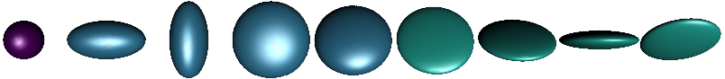

# Symmetric positive definite matrices

```@docs
SymmetricPositiveDefinite
```

This manifold can -- for example -- be illustrated as ellipsoids:  since the eigenvalues are all positive they can be taken as lengths of the axes of an ellipsoids while the directions are given by the eigenvectors.



The manifold can be equipped with different metrics

## Common and metric independent functions

```@autodocs
Modules = [Manifolds]
Pages = ["manifolds/SymmetricPositiveDefinite.jl"]
Order = [:function]
Public=true
Private=false
Filter = t -> t !== mean
```

## Default metric: the linear affine metric

```@autodocs
Modules = [Manifolds]
Pages = ["manifolds/SymmetricPositiveDefiniteLinearAffine.jl"]
Order = [:type]
```

This metric is also the default metric, i.e. any call of the following functions with `P=SymmetricPositiveDefinite(3)` will result in `MetricManifold(P,LinearAffineMetric())`and hence yield the formulae described in this seciton.

```@autodocs
Modules = [Manifolds]
Pages = ["manifolds/SymmetricPositiveDefiniteLinearAffine.jl"]
Order = [:function]
```

## Bures-Wasserstein metric

```@autodocs
Modules = [Manifolds]
Pages = ["manifolds/SymmetricPositiveDefiniteBuresWasserstein.jl"]
Order = [:type, :function]
```

## Generalized Bures-Wasserstein metric

```@autodocs
Modules = [Manifolds]
Pages = ["manifolds/SymmetricPositiveDefiniteGeneralizedBuresWasserstein.jl"]
Order = [:type, :function]
```

## Log-Euclidean metric

```@autodocs
Modules = [Manifolds]
Pages = ["manifolds/SymmetricPositiveDefiniteLogEuclidean.jl"]
Order = [:type, :function]
```

## Log-Cholesky metric

```@autodocs
Modules = [Manifolds]
Pages = ["manifolds/SymmetricPositiveDefiniteLogCholesky.jl"]
Order = [:type, :function]
```

## Statistics

```@autodocs
Modules = [Manifolds]
Pages   = ["SymmetricPositiveDefinite.jl"]
Order = [:function]
Filter = t -> t === mean
```

## Efficient representation

When a point `p` is used in several occasions, it might be beneficial to store the eigenvalues
and vectors of `p` and eventually/optionally ist square root and the inverse of the square root.
The [`SPDPoint`](@ref) can be used for exactly that.

```@docs
SPDPoint
```

and there are three internal functions to be able to use [`SPDPoint`](@ref) interchangeably
with the default representation as a matrix.

```@docs
Manifolds.eigvals_sqrt
Manifolds.eigvals_sqrt_inv
Manifolds.eigvals_sqrt_and_sqrt_inv
```

## Literature
