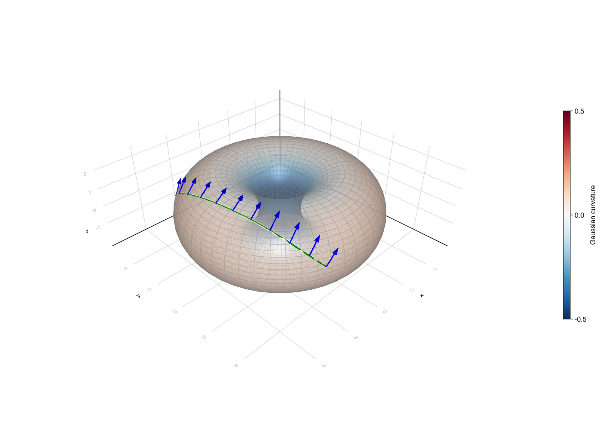
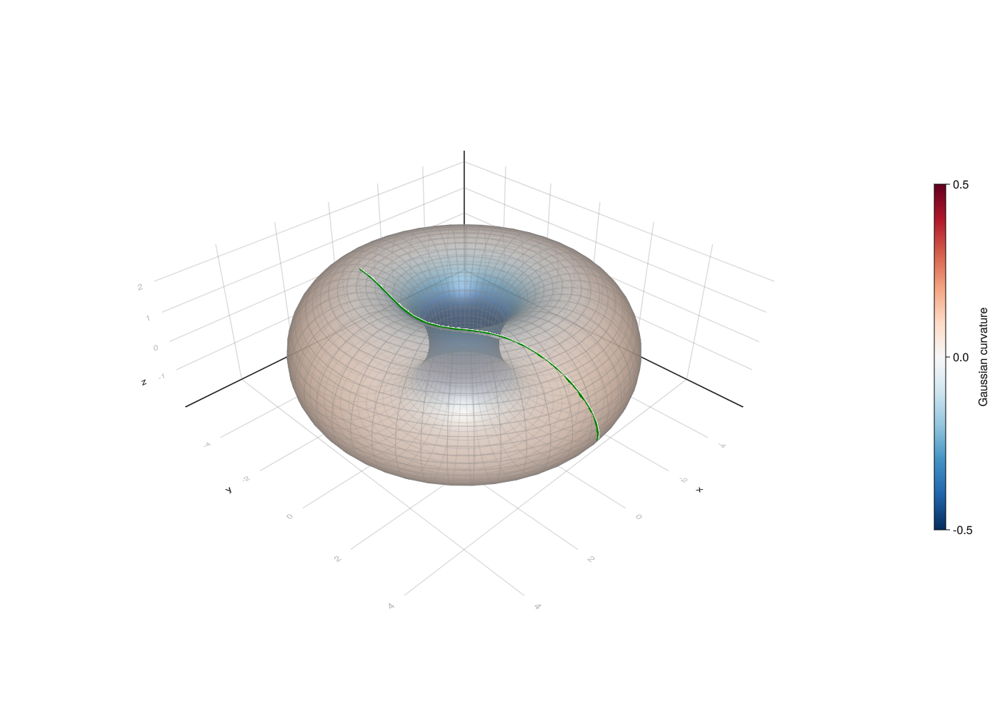

In this tutorial we will learn how to use charts for basic geometric operations like exponential map, logarithmic map and parallel transport.

```{julia}
#| echo: false
#| code-fold: true
#| output: false
using Pkg;
cd(@__DIR__)
Pkg.activate("."); # for reproducibility use the local tutorial environment.
using Markdown
```


There are two conceptually different approaches to working on a manifold: working in charts and chart-free representations.

The first one, widespread in differential geometry textbooks, is based on defining an atlas on the manifold and performing computations in selected charts. This approach, while generic, is not ideally suitable in all circumstances. For example, working in charts that do not cover the entire manifold causes issues with having to switch charts when operating on a manifold.

The second one is beneficial if there exists a representation of points and tangent vectors for a manifold which allows for efficient closed-form formulas for standard functions like the exponential map or Riemannian distance in this representation. These computations are then chart-free. `Manifolds.jl` supports both approaches, although the chart-free approach is the main focus of the library.

In this tutorial we focus on chart-based computation.

```{julia}
#| output: false
using Manifolds, RecursiveArrayTools, OrdinaryDiffEq, DiffEqCallbacks, BoundaryValueDiffEqMIRK
```

The manifold we consider is the `M` is the torus in form of the [`EmbeddedTorus`](https://juliamanifolds.github.io/Manifolds.jl/latest/manifolds/torus.html#Manifolds.EmbeddedTorus), that is the representation defined as a surface of revolution of a circle of radius 2 around a circle of radius 3.
The atlas we will perform computations in is its [`DefaultTorusAtlas`](https://juliamanifolds.github.io/Manifolds.jl/latest/manifolds/torus.html#Manifolds.DefaultTorusAtlas) `A`, consisting of a family of charts indexed by two angles, that specify the base point of the chart.

We will draw geodesics time between `0` and `t_end`, and then sample the solution at multiples of `dt` and draw a line connecting sampled points.

```{julia}
M = Manifolds.EmbeddedTorus(3, 2)
A = Manifolds.DefaultTorusAtlas()
```

## Setup

We will first set up our plot with an empty torus.
`param_points` are points on the surface of the torus that will be used for basic surface shape in `Makie.jl`.
The torus will be colored according to its Gaussian curvature stored in `gcs`. We later want to have a color scale that has negative curvature blue, zero curvature white and positive curvature red so `gcs_mm` is the largest absolute value of the curvature that will be needed to properly set range of curvature values.

In the documentation this tutorial represents a static situation (without interactivity). `Makie.jl` rendering is turned off.

```{julia}
using GLMakie, Makie
GLMakie.activate!()

"""
	torus_figure()

This function generates a simple plot of a torus and returns the new figure containing the plot.
"""
function torus_figure()
    fig = Figure(resolution=(1400, 1000), fontsize=16)
    ax = LScene(fig[1, 1], show_axis=true)
    ϴs, φs = LinRange(-π, π, 50), LinRange(-π, π, 50)
    param_points = [Manifolds._torus_param(M, θ, φ) for θ in ϴs, φ in φs]
    X1, Y1, Z1 = [[p[i] for p in param_points] for i in 1:3]
    gcs = [gaussian_curvature(M, p) for p in param_points]
    gcs_mm = max(abs(minimum(gcs)), abs(maximum(gcs)))
    pltobj = surface!(
        ax,
        X1,
        Y1,
        Z1;
        shading=true,
        backlight=1.0f0,
        color=gcs,
        colormap=Reverse(:RdBu),
        colorrange=(-gcs_mm, gcs_mm),
        transparency=true,
    )
    wireframe!(ax, X1, Y1, Z1; transparency=true, color=:gray, linewidth=0.5)
    zoom!(ax.scene, cameracontrols(ax.scene), 0.98)
    Colorbar(fig[1, 2], pltobj, height=Relative(0.5), label="Gaussian curvature")
    return ax, fig
end

function jacobi_figure(geodesic, vector_fields; colors)
    ax, fig = torus_figure()
    times = 0.0:0.05:1.0
    curve = geodesic.(times)
    points = Point3f.(first.(curve))
    lines!(ax, points; linewidth=4.0, color=:green, label="geodesic")
    indices = 1:4:length(times)
    for (vectors, color) in zip(vector_fields, colors)
        arrows3d!(
            ax,
            Point3f.(first.(vectors[indices])),
            Point3f.(last.(vectors[indices]));
            shaftradius=0.04,
            tiplength=0.1,
            tipradius=0.1,
            color,
        )
    end
    return fig
end
```


## Values for the geodesic

`solve_for` is a helper function that solves a parallel transport along geodesic problem on the torus `M`.
`p0x` is the $(\theta, \varphi)$ parametrization of the point from which we will transport the vector.
We first calculate the coordinates in the embedding of `p0x` and store it as `p`, and then get the initial chart from atlas `A` appropriate for starting working at point `p`.
The vector we transport has coordinates `Y_transp` in the induced tangent space basis of chart `i_p0x`.
The function returns the full solution to the parallel transport problem, containing the sequence of charts that was used and solutions of differential equations computed using `OrdinaryDiffEq`.

`bvp_i` is needed later for a different purpose, it is the chart index we will use for solving the logarithmic map boundary value problem in.

Next we solve the vector transport problem `solve_for([θₚ, φₚ], [θₓ, φₓ], [θy, φy])`, sample the result at the selected time steps and store the result in `geo`. The solution includes the geodesic which we extract and convert to a sequence of points digestible by `Makie.jl`, `geo_ps`.
`[θₚ, φₚ]` is the parametrization in chart (0, 0) of the starting point of the geodesic.
The direction of the geodesic is determined by `[θₓ, φₓ]`, coordinates of the tangent vector at the starting point expressed in the induced basis of chart `i_p0x` (which depends on the initial point).
Finally, `[θy, φy]` are the coordinates of the tangent vector that will be transported along the geodesic, which are also expressed in same basis as `[θₓ, φₓ]`.

We won't draw the transported vector at every point as there would be too many arrows, which is why we select every 100th point only for that purpose with `pt_indices`. Then, `geo_ps_pt` contains points at which the transported vector is tangent to and `geo_Ys` the transported vector at that point, represented in the embedding.

The logarithmic map will be solved between points with parametrization `bvp_a1` and `bvp_a2` in chart `bvp_i`.
The result is assigned to variable `bvp_sol` and then sampled with time step 0.05. The result of this sampling is converted from parameters in chart `bvp_i` to point in the embedding and stored in `geo_r`.


```{julia}
function solve_for(p0x, X_p0x, Y_transp, T)
    p = [Manifolds._torus_param(M, p0x...)...]
    i_p0x = Manifolds.get_chart_index(M, A, p)
    p_exp = Manifolds.solve_chart_parallel_transport_ode(
        M,
        [0.0, 0.0],
        X_p0x,
        A,
        i_p0x,
        Y_transp;
        final_time=T,
    )
    return p_exp
end;
```


### Solving parallel Transport ODE

We set the end time `t_end` and time step `dt`.

```{julia}
t_end = 2.0
dt = 1e-1
```

We also parametrise the start point and direction.

```{julia}
θₚ = π/10
φₚ = -π/4
θₓ = π/2
φₓ = 0.7
θy = 0.2
φy = -0.1

geo = solve_for([θₚ, φₚ], [θₓ, φₓ], [θy, φy], t_end)(0.0:dt:t_end);
geo_ps = [Point3f(s[1]) for s in geo]
pt_indices = 1:div(length(geo), 10):length(geo)
geo_ps_pt = [Point3f(s[1]) for s in geo[pt_indices]]
geo_Ys = [Point3f(s[3]) for s in geo[pt_indices]]

ax1, fig1 = torus_figure()
arrows3d!(ax1, geo_ps_pt, geo_Ys, linewidth=0.05, color=:blue)
lines!(geo_ps; linewidth=4.0, color=:green)
fig1
```



### Solving the logarithmic map ODE

```{julia}
θ₁=π/2
φ₁=-1.0
θ₂=-π/8
φ₂=π/2

bvp_i = (0, 0)
bvp_a1 = [θ₁, φ₁]
bvp_a2 = [θ₂, φ₂]
# bvp_sol = Manifolds.solve_chart_log_bvp(M, bvp_a1, bvp_a2, A, bvp_i);
# geo_r = [Point3f(get_point(M, A, bvp_i, p[1:2])) for p in bvp_sol(0.0:0.05:1.0)]

# ax2, fig2 = torus_figure()
# lines!(geo_r; linewidth=4.0, color=:green)
# fig2
```



## Jacobi fields and differentials in charts

Jacobi fields describe how a geodesic changes when its initial point or initial velocity is
perturbed. The chart-based solvers below work with the coordinate vector `Xc` of the geodesic
velocity and coordinate vectors `Yc` in the induced basis of the current chart. They switch
charts automatically when necessary, just as the parallel-transport solver does.

For this example, choose a short geodesic which remains in its initial chart. This makes the
coordinates at its initial and final points directly comparable. The point `p0` determines a
chart index, and `[0.0, 0.0]` are the coordinates of `p0` in that chart.

```{julia}
p0 = [Manifolds._torus_param(M, θₚ, φₚ)...]
jacobi_i = Manifolds.get_chart_index(M, A, p0)
jacobi_a = [0.0, 0.0]
jacobi_Xc = [2.3, -1.4]
jacobi_Yc = [-0.25, 0.6]

```

### Solving a Jacobi field

[`solve_chart_jacobi_field`](@ref) solves the geodesic and a Jacobi field simultaneously.
Its last two arguments are the initial coordinates of the field, `Yc`, and of its covariant
derivative, `dYc`. Evaluating the returned solution yields `(p, X, Y, dY)`: the geodesic point
and velocity, followed by the Jacobi field and its covariant derivative, all in the embedding.

```{julia}
jacobi_solution = Manifolds.solve_chart_jacobi_field(
    M,
    jacobi_a,
    jacobi_Xc,
    A,
    jacobi_i,
    jacobi_Yc,
    [0.05, -0.1];
    final_time=1.0,
)
p1, X1, J1, ∇J1 = jacobi_solution(1.0)
```

Plot the geodesic and the Jacobi field. The blue arrows show the field $J$ and the orange
arrows show its covariant derivative $\nabla_{\dot\gamma}J$.

```{julia}
jacobi_times = 0.0:0.05:1.0
jacobi_values = jacobi_solution(jacobi_times)
jacobi_vectors = [(value[1], value[3]) for value in jacobi_values]
jacobi_derivatives = [(value[1], value[4]) for value in jacobi_values]
jacobi_figure(
    t -> jacobi_solution(t)[1:2],
    [jacobi_vectors, jacobi_derivatives];
    colors=[:dodgerblue, :darkorange],
)
```

The two exponential-map differential helpers select the appropriate initial conditions for
common variations. `solve_chart_differential_exp_basepoint` uses $Y(0)=Y_c$ and
$\nabla_{\dot\gamma}Y(0)=0$, while `solve_chart_differential_exp_argument` uses
$Y(0)=0$ and $\nabla_{\dot\gamma}Y(0)=Y_c$. Consequently, the Jacobi field at time `1.0`
is respectively $D_p\exp_p(X)[Y]$ or $D_X\exp_p(X)[Y]$.

```{julia}
dexp_basepoint_solution = Manifolds.solve_chart_differential_exp_basepoint(
    M, jacobi_a, jacobi_Xc, A, jacobi_i, jacobi_Yc; final_time=1.0
)
dexp_argument_solution = Manifolds.solve_chart_differential_exp_argument(
    M, jacobi_a, jacobi_Xc, A, jacobi_i, jacobi_Yc; final_time=1.0
)

_, _, differential_exp_basepoint, _ = dexp_basepoint_solution(1.0)
_, _, differential_exp_argument, _ = dexp_argument_solution(1.0)
```

The following plot compares the two endpoint fields. The blue field corresponds to moving the
base point and the orange field corresponds to changing the initial velocity.

```{julia}
dexp_basepoint_values = dexp_basepoint_solution(jacobi_times)
dexp_argument_values = dexp_argument_solution(jacobi_times)
dexp_basepoint_vectors = [(value[1], value[3]) for value in dexp_basepoint_values]
dexp_argument_vectors = [(value[1], value[3]) for value in dexp_argument_values]
jacobi_figure(
    t -> dexp_basepoint_solution(t)[1:2],
    [dexp_basepoint_vectors, dexp_argument_vectors];
    colors=[:dodgerblue, :darkorange],
)
```

The determinant of $D_X\exp_p(X)$, corrected by the local metric determinants at the start
and end of the geodesic, is the volume density of the exponential map. It is available without
having to construct all Jacobi fields separately.

```{julia}
chart_volume_density = Manifolds.solve_chart_volume_density(
    M, jacobi_a, jacobi_Xc, A, jacobi_i
)
```

The volume density is a scalar, so represent it by coloring the geodesic according to the
volume density computed for scaled initial velocities $tX$.

```{julia}
volume_densities = [
    Manifolds.solve_chart_volume_density(M, jacobi_a, t .* jacobi_Xc, A, jacobi_i)
    for t in jacobi_times
]
volume_geodesic = Manifolds.solve_chart_exp_ode(M, jacobi_a, jacobi_Xc, A, jacobi_i)
volume_points = Point3f.(first.(volume_geodesic(jacobi_times)))
ax_volume, fig_volume = torus_figure()
lines!(
    ax_volume,
    volume_points;
    color=volume_densities,
    colormap=:viridis,
    colorrange=extrema(volume_densities),
    linewidth=6.0,
)
Colorbar(fig_volume[1, 3], limits=extrema(volume_densities), colormap=:viridis, label="volume density")
fig_volume
```

### Differentials and adjoints of the logarithmic map

Let $q=\exp_p(X)$. The logarithmic-map helpers return Jacobi-field solutions whose covariant
derivative at time `0.0` is the requested differential. For the base-point differential,
`jacobi_Yc` represents a vector at $p$; for the argument differential it represents a vector
at $q$ in the final chart. Since the short geodesic above does not switch charts, both use
the same induced basis here.

```{julia}
dlog_basepoint_solution = Manifolds.solve_chart_differential_log_basepoint(
    M, jacobi_a, jacobi_Xc, A, jacobi_i, jacobi_Yc; final_time=1.0
)
dlog_argument_solution = Manifolds.solve_chart_differential_log_argument(
    M, jacobi_a, jacobi_Xc, A, jacobi_i, jacobi_Yc; final_time=1.0
)

_, _, _, differential_log_basepoint = dlog_basepoint_solution(0.0)
_, _, _, differential_log_argument = dlog_argument_solution(0.0)
```

The logarithmic-map fields are fixed at the endpoint and evaluated backwards along the same
geodesic. The arrows at the base point show their values, which are the two requested
differentials of `log`.

```{julia}
dlog_basepoint_values = dlog_basepoint_solution(jacobi_times)
dlog_argument_values = dlog_argument_solution(jacobi_times)
dlog_basepoint_vectors = [(value[1], value[3]) for value in dlog_basepoint_values]
dlog_argument_vectors = [(value[1], value[3]) for value in dlog_argument_values]
jacobi_figure(
    t -> dlog_basepoint_solution(t)[1:2],
    [dlog_basepoint_vectors, dlog_argument_vectors];
    colors=[:dodgerblue, :darkorange],
)
```

The adjoint helpers return coordinates directly, rather than a time-dependent Jacobi-field
solution. The adjoints of the exponential-map differentials map a vector at $q$ back to $p$.
The adjoints of the logarithmic-map differentials have the converse domain and codomain.

```{julia}
adjoint_differential_exp_basepoint = Manifolds.solve_chart_adjoint_differential_exp_basepoint(
    M, jacobi_a, jacobi_Xc, A, jacobi_i, jacobi_Yc
)
adjoint_differential_exp_argument = Manifolds.solve_chart_adjoint_differential_exp_argument(
    M, jacobi_a, jacobi_Xc, A, jacobi_i, jacobi_Yc
)
adjoint_differential_log_basepoint = Manifolds.solve_chart_adjoint_differential_log_basepoint(
    M, jacobi_a, jacobi_Xc, A, jacobi_i, jacobi_Yc
)
adjoint_differential_log_argument = Manifolds.solve_chart_adjoint_differential_log_argument(
    M, jacobi_a, jacobi_Xc, A, jacobi_i, jacobi_Yc
)
```

Visualize the adjoints at their respective source and target points. Blue arrows are the input
coordinates interpreted at their source point; orange arrows are the returned coordinates at
the target point. This makes the direction reversal of each adjoint explicit.

```{julia}
q = dexp_basepoint_solution(1.0)[1]
Bp = induced_basis(M, A, jacobi_i)
Bq = induced_basis(M, A, jacobi_i)
adjoint_pairs = [
    (q, get_vector(M, q, jacobi_Yc, Bq), p0, get_vector(M, p0, adjoint_differential_exp_basepoint, Bp)),
    (q, get_vector(M, q, jacobi_Yc, Bq), p0, get_vector(M, p0, adjoint_differential_exp_argument, Bp)),
    (p0, get_vector(M, p0, jacobi_Yc, Bp), p0, get_vector(M, p0, adjoint_differential_log_basepoint, Bp)),
    (p0, get_vector(M, p0, jacobi_Yc, Bp), q, get_vector(M, q, adjoint_differential_log_argument, Bq)),
]
adjoint_labels = ["adjoint d exp base point", "adjoint d exp argument", "adjoint d log base point", "adjoint d log argument"]

fig_adjoint = Figure(size=(1400, 1000), fontsize=16)
for (k, (source, input, target, output)) in enumerate(adjoint_pairs)
    row, column = div(k - 1, 2) + 1, mod(k - 1, 2) + 1
    grid = GridLayout(fig_adjoint[row, column])
    Label(grid[1, 1], adjoint_labels[k])
    ax = LScene(grid[2, 1], show_axis=true)
    arrows3d!(ax, [Point3f(source)], [Point3f(input)]; color=:dodgerblue, linewidth=0.05)
    arrows3d!(ax, [Point3f(target)], [Point3f(output)]; color=:darkorange, linewidth=0.05)
end
fig_adjoint
```

For a geodesic that crosses a chart boundary, the returned `StitchedChartSolution` still
evaluates to embedding-space points and tangent vectors. When supplying or interpreting raw
coordinates to the logarithmic or adjoint routines, use the induced basis of the initial chart
at $p$ or of the final chart at $q$, as specified by the corresponding function.

An interactive Pluto version of this tutorial is available in file [`tutorials/working-in-charts.jl`](https://github.com/JuliaManifolds/Manifolds.jl/blob/616855447996fb1ee7dfb2a779341b962a1323f8/tutorials/working-in-charts.jl).
